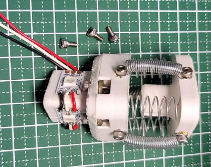
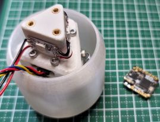
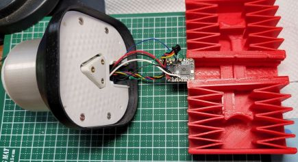
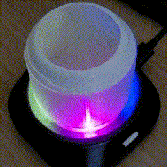

# DIY Spacemouse for Fusion 360
build enviroment : PlatformIo

# Requirement
* Visual Studio Code
* PlatfromIO

change from original
- just using <Adafruit_TinyUSB.h>
- use three full color serial leds.
- chage key conbination of "Home" to CTLR+SHFIT+h

---

# DEMO

---
* junichiro okabe  KYOTO, JAPAN 

* E-mail j1okabe＠gmail.com

[![CC BY-NC-SA 4.0][cc-by-nc-sa-shield]][cc-by-nc-sa]

[![CC BY-NC-SA 4.0][cc-by-nc-sa-image]][cc-by-nc-sa]

[cc-by-nc-sa]: http://creativecommons.org/licenses/by-nc-sa/4.0/
[cc-by-nc-sa-image]: https://licensebuttons.net/l/by-nc-sa/4.0/88x31.png
[cc-by-nc-sa-shield]: https://img.shields.io/badge/License-CC%20BY--NC--SA%204.0-lightgrey.svg
